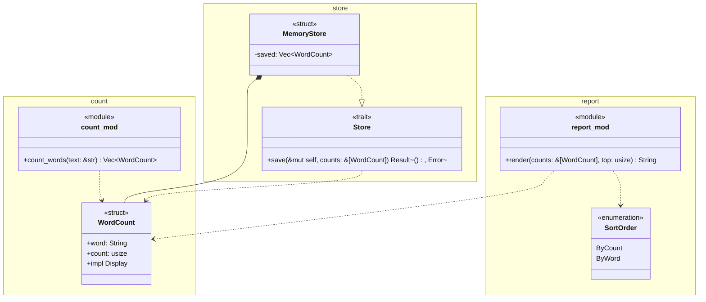

# 型とモジュールの図の書き方

各Iterationでは，テストリストを書いたあと実装の前に図を更新し，実装のあとで実装と見比べる．

```text
テストリスト → 図の更新 → テスト駆動の実装 → 設計レビュー
```

テストリストは，プログラムが外から見てどう振る舞うか(振る舞い)を書く．
図は，その振る舞いをどんなモジュール，型，関数で実現するか(構造)を書く．
同じ機能を，テストリストは外側から，図は内側から記述する．

## 図のファイル

図は各パッケージの`design/types.md`の1枚である．Markdownの中に，Mermaidの`classDiagram`で描く．
1枚の図に，2つの段階の構造を重ねて描く．

- モジュールの段階：モジュールを名前空間(`namespace`)の枠で描く．
- 型の段階：枠の中に，モジュールが定義する型(`struct`，`enum`，`trait`，`type`)と公開関数を描き，型の間の関係を矢印で描く．

## 例の題材

このガイドの例では，`rgit`とは別の小さなプログラム`wordfreq`を使う．
`wordfreq`は，テキストの単語を数え，多い順に表示するライブラリである．

```rust
let report = wordfreq::report::render(&wordfreq::count::count_words("b a b"), 1);
assert_eq!(report, "b 2\n");
```

`wordfreq`は次のモジュールからなる．

- `count`：単語を数える．`WordCount`型と`count_words`関数を持つ．
- `report`：数えた結果を並べ替えて文字列にする．`SortOrder`型と`render`関数を持つ．
- `store`：結果を保存する先を表すトレイト`Store`と，その実装`MemoryStore`を持つ．

## 図の例



- `render`は，同じ回数の単語を単語の辞書順に並べる．
- `MemoryStore`はテストで使う．

## 書き方の規則

### モジュール

- モジュールを`namespace モジュール名 { … }`で描く．名前はファイルの名前と同じにする(`src/count.rs`なら`count`)．
- モジュールの公開関数(`impl`の外にある`pub fn`)は，名前空間の中のクラス`モジュール名_mod`に書き，ステレオタイプ`<<module>>`を付ける．公開関数のないモジュールには，このクラスを描かない．
- クラスに名前空間と同じ名前を付けない．Mermaidは，同じ名前の名前空間とクラスを描画できない．
- `lib.rs`と`main.rs`は，ほかのモジュールを宣言して呼ぶだけにし，図に描かない．

### 型

- 型を`class 型名`で，そのモジュールの名前空間の中に描く．型の種類はステレオタイプ(`<<struct>>`，`<<enumeration>>`，`<<trait>>`，`<<type>>`)で示す．
- 型引数は`~`で囲む(`Repository~S~`，`Vec~WordCount~`)．
- フィールドとメソッドには型を書く．非公開のものには`-`を，公開のものには`+`を付ける．
- 標準ライブラリのトレイトの実装は，`+impl Display`のように1行で書く．
- 標準ライブラリと外部のクレートの型(`String`，`PathBuf`，`io::Error`など)は，クラスとして描かない．

### 関係

| 関係 | 記法 | 使う場面 |
| --- | --- | --- |
| 所有(コンポジション) | `A *-- B` | AのフィールドがBを値として持つ(`Vec<B>`，`Option<B>`，`Box<B>`を含む) |
| 参照(関連) | `A --> B` | AのフィールドがBへの参照を持つ |
| 実装 | `A ..\|> T` | AがトレイトTを実装する |
| 依存 | `A ..> B` | Aの関数やメソッドの引数や戻り値がBを使う |

- 所有，参照，実装の矢印は，すべて描く．依存の矢印は，モジュールの間の主な依存を描く．
- 図で表せない規則や細かいこと(非公開の補助関数の名前など)は，図の下に箇条書きで書く．
- 図の上に，何を示す図かを1〜2文で書く．
- 図には，プログラムの現在の状態だけを書く．

## 図の確認

VS CodeのMarkdownのプレビューで，Mermaidの図を表示できる(拡張機能「Markdown Preview Mermaid Support」を使う)．GitHubでは，そのまま図として表示される．

構文の検査は，演習のディレクトリで次のように実行する．

```console
$ node ../../../scripts/check-mermaid.mjs design/types.md
mermaid: 1 blocks, 0 errors
```

設計レビューでは，図とコードを照合できる．
照合するのは，名前空間とモジュール，クラスと型，`<<module>>`のクラスの関数と公開関数の名前である．

```console
$ node ../../../scripts/check-design.mjs .
design: 1 packages, 0 errors
```

照合の結果に「図の名前空間にない」型が出たら，図に描き足すか，その型を置くモジュールが設計の意図と合っているかを見直す．
