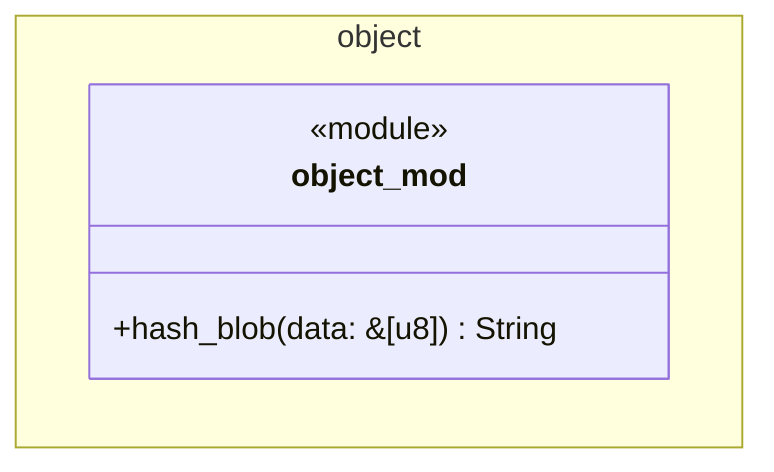

# 型とモジュールの図

`rgit`のモジュールと公開関数を示す．
このIterationの`rgit`は，blobのハッシュを計算する`object`モジュールだけからなる．

- `object`は，バイト列を16進数の文字列にする非公開の関数`to_hex`を持つ．
- `lib.rs`は`hash_blob`を`pub use`で公開する．`main.rs`は標準入力を読み，`hash_blob`の結果を出力する．
- SHA-1の計算には，外部のクレート`sha1`の`Sha1`を使う．
