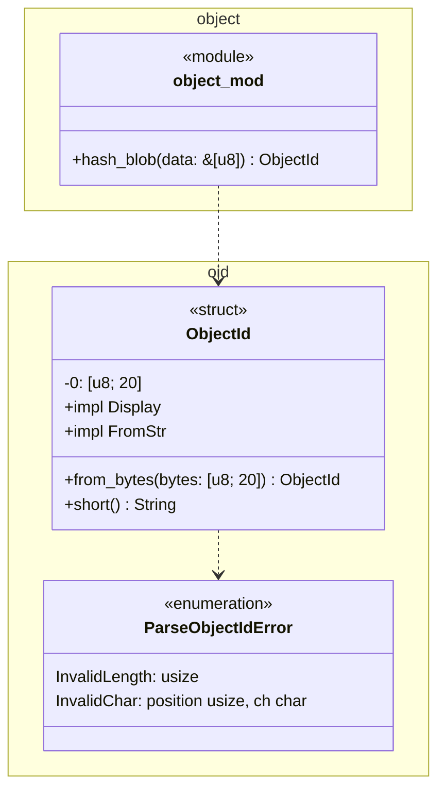

# 型とモジュールの図

`rgit`のモジュール，型，公開関数を示す．
`oid`はオブジェクトIDの型を，`object`はblobのIDを計算する関数を持つ．

- `ObjectId`は`Copy`，`Clone`，`PartialEq`，`Eq`，`Debug`を導出する．
- `ObjectId`の`FromStr`は，大文字の16進数も受け付ける．失敗の理由を`ParseObjectIdError`で返す．
- `lib.rs`は`hash_blob`，`ObjectId`，`ParseObjectIdError`を`pub use`で公開する．
- SHA-1の計算には，外部のクレート`sha1`の`Sha1`を使う．
