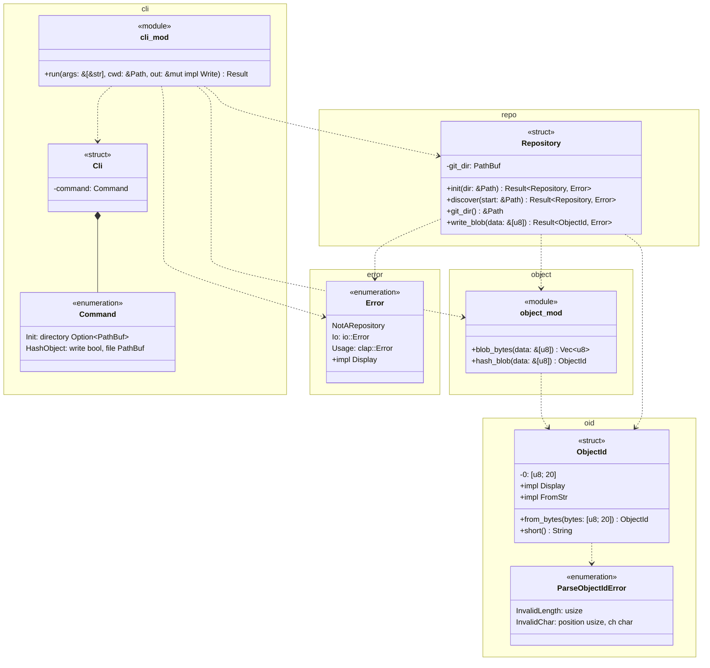

# 型とモジュールの図

`rgit`のモジュール，型，公開関数を示す．
`cli`がコマンドラインの引数を解釈し，`repo`の`Repository`でオブジェクトを書き込む．

- `run`の戻り値は`Result<(), Error>`である．
- `Cli`と`Command`はclapの`Parser`と`Subcommand`を導出する．`Error`はthiserrorの`Error`を導出し，`io::Error`と`clap::Error`から`?`で変換できる．
- `Repository`は非公開のメソッド`object_path`で，IDからオブジェクトのファイルのパスを作る．
- zlibの圧縮には，外部のクレート`flate2`の`ZlibEncoder`を使う．
- `lib.rs`は`cli`を公開モジュールにし，`Error`，`hash_blob`，`ObjectId`，`ParseObjectIdError`を`pub use`で公開する．
- `main.rs`は`cli::run`を呼ぶ．`Error::Usage`ならclapのメッセージを出して終了コード2で，ほかのエラーなら`fatal: <メッセージ>`を出して終了コード128で終わる．
