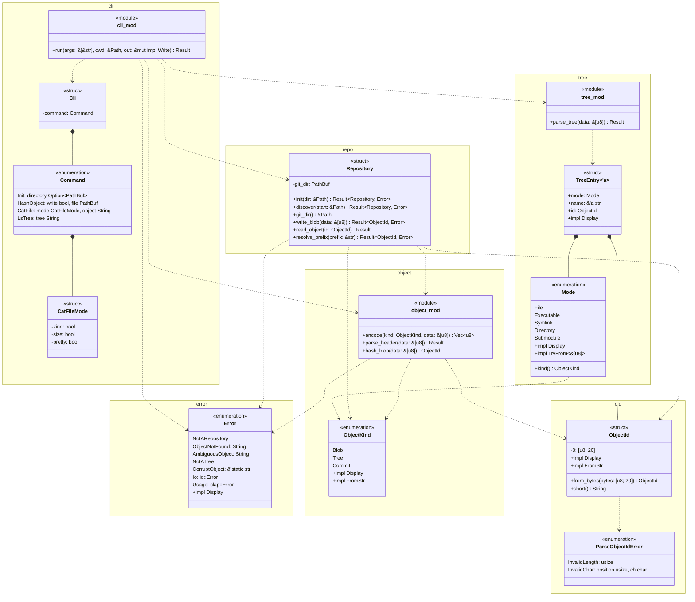

# 型とモジュールの図

`rgit`のモジュール，型，公開関数を示す．
`cli`がコマンドラインの引数を解釈し，`repo`の`Repository`でオブジェクトを読み書きする．`tree`はtreeオブジェクトの内容を解析する．

- `run`の戻り値は`Result<(), Error>`である．
- `read_object`の戻り値は`Result<(ObjectKind, Vec<u8>), Error>`，`parse_header`の戻り値は`Result<(ObjectKind, &[u8]), Error>`である．`parse_header`が返す内容は，引数のバイト列の一部を借りたものである．
- `Cli`と`Command`はclapの`Parser`と`Subcommand`を導出する．`CatFileMode`は`Args`を導出し，`-t`，`-s`，`-p`のどれか1つだけを受け付ける．`Error`はthiserrorの`Error`を導出し，`io::Error`と`clap::Error`から`?`で変換できる．
- `parse_tree`の戻り値は`Result<Vec<TreeEntry<'_>>, Error>`である．
- `TreeEntry`の`name`は，`parse_tree`に渡したバイト列の一部を借りている．`TreeEntry`は，そのバイト列より長く使えない．
- `cli`は非公開の関数`write_tree_entries`で，treeのエントリーを1行ずつ書く．`cat-file -p`と`ls-tree`の両方が使う．
- `Repository`は非公開のメソッド`object_path`で，IDからオブジェクトのファイルのパスを作る．
- zlibの圧縮には，外部のクレート`flate2`の`ZlibEncoder`を使う．
- `lib.rs`は`cli`を公開モジュールにし，`Error`，`hash_blob`，`ObjectId`，`ParseObjectIdError`を`pub use`で公開する．
- `main.rs`は`cli::run`を呼ぶ．`Error::Usage`ならclapのメッセージを出して終了コード2で，ほかのエラーなら`fatal: <メッセージ>`を出して終了コード128で終わる．
