# 型とモジュールの図

`rgit`のモジュール，型，公開関数を示す．
`cli`がコマンドラインの引数を解釈し，`repo`の`Repository`でオブジェクトを読み書きする．`tree`はtreeオブジェクトの内容を解析する．`index`はインデックスを読み書きし，`worktree`は作業ディレクトリのファイルを集める．`commit`はcommitオブジェクトを組み立て，解析し，直列化する．`refs`は参照を，`lockfile`はファイルの安全な置き換えを，`revision`はリビジョンの指定の解決を受け持つ．

```mermaid
classDiagram
    namespace cli {
        class cli_mod {
            <<module>>
            +run(args: &[&str], cwd: &Path, env: &HashMap~String, String~, out: &mut impl Write) Result
        }
        class Cli {
            <<struct>>
            -command: Command
        }
        class Command {
            <<enumeration>>
            Init: directory Option~PathBuf~
            HashObject: write bool, file PathBuf
            CatFile: mode CatFileMode, object String
            LsTree: tree String
            Add: paths Vec~PathBuf~
            LsFiles: stage bool
            WriteTree
            Commit: message String
            RevParse: rev String
            Branch: name Option~String~, start Option~String~
            CommitTree: tree String, parents Vec~String~, message String
        }
        class CatFileMode {
            <<struct>>
            -kind: bool
            -size: bool
            -pretty: bool
        }
    }
    namespace repo {
        class Repository {
            <<struct>>
            -work_dir: PathBuf
            -git_dir: PathBuf
            +init(dir: &Path) Result~Repository, Error~
            +discover(start: &Path) Result~Repository, Error~
            +git_dir() &Path
            +index_path() PathBuf
            +add(cwd: &Path, pathspecs: &[PathBuf]) Result
            +write_blob(data: &[u8]) Result~ObjectId, Error~
            +write_object(kind: ObjectKind, data: &[u8]) Result~ObjectId, Error~
            +write_tree(index: &Index) Result~ObjectId, Error~
            +read_object(id: ObjectId) Result
            +resolve_prefix(prefix: &str) Result~ObjectId, Error~
            +read_ref(name: &RefName) Result
            +final_ref_name(name: &RefName) Result~RefName, Error~
            +resolve_ref(name: &RefName) Result
            +update_ref(name: &RefName, id: ObjectId) Result
            +branches() Result
            +commit(commit: Commit) Result~ObjectId, Error~
        }
    }
    namespace error {
        class Error {
            <<enumeration>>
            NotARepository
            ObjectNotFound: String
            AmbiguousObject: String
            NotATree
            CorruptObject: &'static str
            CorruptIndex: &'static str
            PathspecNotMatched: String
            OutsideRepository: String
            MissingVariable: String
            InvalidDate: String
            InvalidRefName: String
            InvalidBranchName: String
            BranchExists: String
            Locked: String
            Io: io::Error
            Usage: clap::Error
            +impl Display
        }
    }
    namespace object {
        class object_mod {
            <<module>>
            +encode(kind: ObjectKind, data: &[u8]) Vec~u8~
            +parse_header(data: &[u8]) Result
            +hash_object(kind: ObjectKind, data: &[u8]) ObjectId
            +hash_blob(data: &[u8]) ObjectId
        }
        class ObjectKind {
            <<enumeration>>
            Blob
            Tree
            Commit
            +impl Display
            +impl FromStr
        }
    }
    namespace tree {
        class tree_mod {
            <<module>>
            +parse_tree(data: &[u8]) Result
            +compare_entries(a: &TreeEntry, b: &TreeEntry) Ordering
            +tree_bytes(entries: Vec~TreeEntry~) Vec~u8~
        }
        class Mode {
            <<enumeration>>
            File
            Executable
            Symlink
            Directory
            Submodule
            +kind() ObjectKind
            +bits() u32
            +impl Display
            +impl TryFrom~&[u8]~
            +impl TryFrom~u32~
        }
        class TreeEntry~'a~ {
            <<struct>>
            +mode: Mode
            +name: &'a str
            +id: ObjectId
            +impl Display
        }
    }
    namespace commit {
        class commit_mod {
            <<module>>
            +parse_offset(text: &str) Option~i32~
        }
        class Signature {
            <<struct>>
            +name: String
            +email: String
            +time: i64
            +offset_minutes: i32
            +parse(text: &str) Result~Signature, Error~
            +impl Display
        }
        class Commit {
            <<struct>>
            +tree: ObjectId
            +parents: Vec~ObjectId~
            +author: Signature
            +committer: Signature
            +message: String
            +builder() CommitBuilder
            +parse(data: &[u8]) Result~Commit, Error~
            +to_bytes() Vec~u8~
        }
        class Missing {
            <<struct>>
        }
        class CommitBuilder~T, A, C~ {
            <<struct>>
            -tree: T
            -parents: Vec~ObjectId~
            -author: A
            -committer: C
            -message: String
            +tree(tree: ObjectId) CommitBuilder
            +author(author: Signature) CommitBuilder
            +committer(committer: Signature) CommitBuilder
            +parent(parent: ObjectId) CommitBuilder
            +message(message: &str) CommitBuilder
            +build() Commit
        }
    }
    namespace refs {
        class RefName {
            <<struct>>
            -0: String
            +head() RefName
            +branch(name: &str) Result~RefName, Error~
            +as_str() &str
            +branch_name() Option~&str~
            +impl TryFrom~&str~
            +impl Display
        }
        class Ref {
            <<enumeration>>
            Direct: ObjectId
            Symbolic: RefName
            +parse(text: &str) Result~Ref, Error~
        }
    }
    namespace lockfile {
        class LockFile {
            <<struct>>
            -path: PathBuf
            -lock_path: PathBuf
            -file: File
            -committed: bool
            +acquire(path: &Path) Result~LockFile, Error~
            +write_all(data: &[u8]) Result
            +commit(self) Result
            +impl Drop
        }
    }
    namespace revision {
        class revision_mod {
            <<module>>
            +resolve(repo: &Repository, rev: &str) Result~ObjectId, Error~
        }
    }
    namespace index {
        class Index {
            <<struct>>
            -entries: BTreeMap~String, IndexEntry~
            +entries() &BTreeMap~String, IndexEntry~
            +insert(path: String, entry: IndexEntry)
            +remove(path: &str)
            +load(path: &Path) Result~Index, Error~
            +save(path: &Path) Result
            +parse(data: &[u8]) Result~Index, Error~
            +to_bytes() Vec~u8~
        }
        class IndexEntry {
            <<struct>>
            +stat: Stat
            +mode: Mode
            +id: ObjectId
        }
        class Stat {
            <<struct>>
            +ctime: u32
            +ctime_nsec: u32
            +mtime: u32
            +mtime_nsec: u32
            +dev: u32
            +ino: u32
            +uid: u32
            +gid: u32
            +size: u32
            +from_metadata(meta: &Metadata) Stat
        }
        class Reader~'a~ {
            <<struct>>
            -rest: &'a [u8]
            -take(n: usize) Result~&'a [u8], Error~
            -u32() Result~u32, Error~
            -u16() Result~u16, Error~
        }
    }
    namespace worktree {
        class worktree_mod {
            <<module>>
            +list_files(work_dir: &Path, dir: &Path) Result
            +relative_path(work_dir: &Path, path: &Path) Option~String~
        }
    }
    namespace oid {
        class ObjectId {
            <<struct>>
            -0: [u8; 20]
            +from_bytes(bytes: [u8; 20]) ObjectId
            +as_bytes() &[u8; 20]
            +short() String
            +impl Display
            +impl FromStr
        }
        class ParseObjectIdError {
            <<enumeration>>
            InvalidLength: usize
            InvalidChar: position usize, ch char
        }
    }
    Cli *-- Command
    Command *-- CatFileMode
    cli_mod ..> Cli
    cli_mod ..> Repository
    cli_mod ..> Error
    cli_mod ..> object_mod
    Repository ..> object_mod
    cli_mod ..> tree_mod
    tree_mod ..> TreeEntry
    TreeEntry *-- Mode
    TreeEntry *-- ObjectId
    Mode ..> ObjectKind
    Repository ..> ObjectId
    Repository ..> Ref
    Repository ..> RefName
    Repository ..> LockFile
    Repository ..> Commit
    Index ..> LockFile
    Ref *-- RefName
    Ref *-- ObjectId
    revision_mod ..> Repository
    revision_mod ..> RefName
    cli_mod ..> revision_mod
    cli_mod ..> RefName
    Repository ..> tree_mod
    Repository ..> TreeEntry
    cli_mod ..> Commit
    cli_mod ..> Signature
    cli_mod ..> commit_mod
    Commit *-- Signature
    Commit *-- ObjectId
    CommitBuilder ..> Commit
    CommitBuilder ..> Missing
    Repository ..> Index
    Repository ..> worktree_mod
    cli_mod ..> Index
    Index *-- IndexEntry
    Index ..> Reader
    IndexEntry *-- Stat
    IndexEntry *-- Mode
    IndexEntry *-- ObjectId
    Repository ..> ObjectKind
    Repository ..> Error
    object_mod ..> ObjectId
    object_mod ..> ObjectKind
    object_mod ..> Error
    ObjectId ..> ParseObjectIdError
```

- `run`の戻り値は`Result<(), Error>`である．
- `read_object`の戻り値は`Result<(ObjectKind, Vec<u8>), Error>`，`parse_header`の戻り値は`Result<(ObjectKind, &[u8]), Error>`である．`parse_header`が返す内容は，引数のバイト列の一部を借りたものである．
- `Cli`と`Command`はclapの`Parser`と`Subcommand`を導出する．`CatFileMode`は`Args`を導出し，`-t`，`-s`，`-p`のどれか1つだけを受け付ける．`Error`はthiserrorの`Error`を導出し，`io::Error`と`clap::Error`から`?`で変換できる．
- `Index::save`と`Repository::add`の戻り値は`Result<(), Error>`，`list_files`の戻り値は`Result<Vec<String>, Error>`である．
- `Repository::add`は，非公開の関数`is_under`で，インデックスのパスが指定したパスの下にあるかを調べる．
- `Index::parse`は，`Reader`でバイト列を先頭から読む．
- `Commit::builder`は`CommitBuilder<Missing, Missing, Missing>`を返す．`tree`，`author`，`committer`は，それぞれ型引数の`T`，`A`，`C`を`ObjectId`，`Signature`，`Signature`に変えた`CommitBuilder`を返す．`build`は`CommitBuilder<ObjectId, Signature, Signature>`にだけある．
- `cli`は，非公開の関数`signature_from_env`と`parse_date`で，環境変数から署名を作る．
- `Repository`の`read_ref`の戻り値は`Result<Option<Ref>, Error>`，`resolve_ref`の戻り値は`Result<Option<ObjectId>, Error>`である．
- `Repository`の`update_ref`の戻り値は`Result<(), Error>`，`branches`の戻り値は`Result<Vec<String>, Error>`である．
- `LockFile::commit`は`self`を受け取るので，呼んだあとのロックは使えない．`commit`せずに捨てると，`Drop`が`.lock`のファイルを消す．
- `RefName`は，非公開の関数`is_valid_ref_path`で参照名の規則を調べる．
- `Repository::write_tree`は，非公開のメソッド`write_subtree`を再帰で呼び，ディレクトリごとにtreeを書く．
- `parse_tree`の戻り値は`Result<Vec<TreeEntry<'_>>, Error>`である．
- `TreeEntry`の`name`は，`parse_tree`に渡したバイト列の一部を借りている．`TreeEntry`は，そのバイト列より長く使えない．
- `cli`は非公開の関数`write_tree_entries`で，treeのエントリーを1行ずつ書く．`cat-file -p`と`ls-tree`の両方が使う．
- `Repository`は非公開のメソッド`object_path`で，IDからオブジェクトのファイルのパスを作る．
- zlibの圧縮には，外部のクレート`flate2`の`ZlibEncoder`を使う．
- `lib.rs`は`cli`を公開モジュールにし，`Commit`，`Missing`，`Signature`，`Error`，`hash_blob`，`ObjectId`，`ParseObjectIdError`を`pub use`で公開する．
- `main.rs`は`cli::run`を呼ぶ．`Error::Usage`ならclapのメッセージを出して終了コード2で，ほかのエラーなら`fatal: <メッセージ>`を出して終了コード128で終わる．
